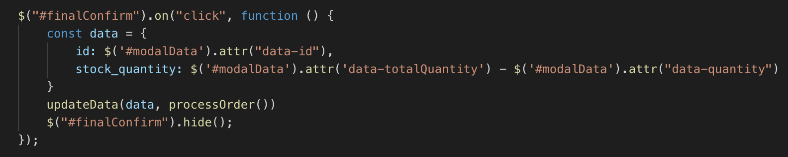

# Bamazon

## Overview
Full-stack web application that displays products that are stored in database. User can select the number of items they would like to "purchase" and changes are made to database.

##Instructions
User inputs the number of a specific product they would like to purchase. Upon clicking "Order", user will be shown the amount of that product they are purchasing, the cost per item, and the total cost of the transaction. After confirming the order, the amount of items purchased is subtracted from the database and the new current amount is displayed. If the user attempts to purchase more items than are in stock, they will be unable to complete the transaction.

##Code Breakdown

* Model for each product created in database through Sequelize, ID, time created, and time updated are also given to each product automatically via Sequelize.

* Sets up Express server that will only run if correctly synced with Product model.

* After getting products from database, loops through each product and using template literals, creates a card for each product and displays to DOM.

* After user clicks "order", stores specific product values in variables. If there are enough products in stock to fill user's order, summary of order including price, quantity, and total cost are shown in a pop up modal.

* If user purchase is able to be filled. Final confirmation is required where new stock inventory is stored in object and passed through an updateData function as a parameter that updates the database. 

##Technology
Language: JavaScript
Runtime Environment: Node

Package Dependencies:
* Express
* Sequelize
* mysql2
* Sequelize-cli

##GitHub Repository
(https://github.com/wwhite12/Bamazon.git)

###Creator
William White